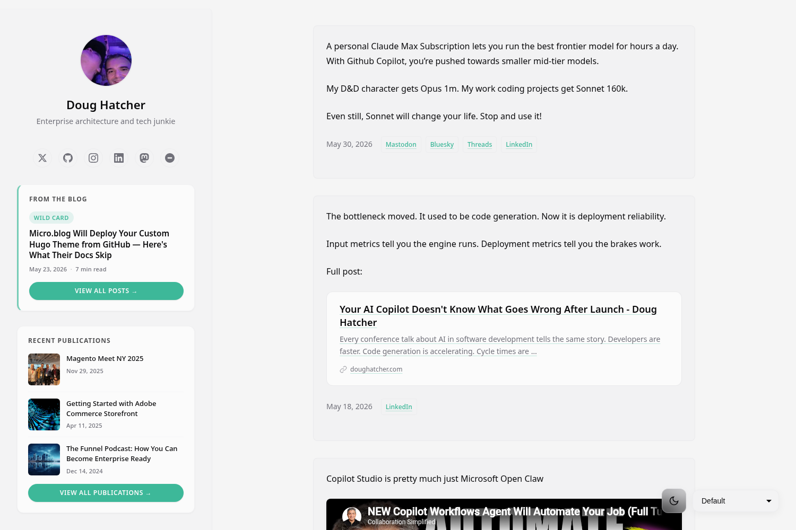

# Dougie — a micro.blog theme

A versatile [Hugo](https://gohugo.io) theme for [Micro.blog](https://micro.blog)-hosted sites. One theme that carries a **microblog timeline**, a **long-form publication**, or both on the same site — and reconfigures per site through the plugin settings panel, with no code changes.



The same theme drives three very different sites from one shared codebase:

- a C-level consulting publication ([doughatcher.com](https://doughatcher.com))
- an Americana politics microblog ([leaning.blue](https://leaning.blue))
- a personal dev timeline ([superterran.net](https://superterran.net))

No forks. Every visual and structural choice is a per-site setting.

---

## Features

- **Two visual variants** — *Default* (clean editorial, light) and *Starfield* (animated dark) — switchable per site, optionally visitor-switchable via a floating chooser.
- **Two identity layouts** — left **sidebar** rail or full-width **topbar** header.
- **Three homepage compositions** — `feed`, `magazine`, or `sectioned`, plus an optional featured-blog block (hero + 3 cards) at the top.
- **Microblog + long-form in one** — short notes render inline; titled posts get full treatment; a `/blog/` section gets a featured header; a `publications` category powers a publications grid.
- **Editorial pillars & topics** — collapse blog pillars (or categories) into a single tidy **Topics** dropdown in the nav.
- **Six accent palettes**, **three type pairings**, light/dark mode with a toggle.
- **Cross-site nav** — additive sibling-site links, or a fully explicit tab override.
- **Per-site About page** — write the `/about/` body right in plugin settings.
- **Rich content** — link-preview & YouTube embed cards, post thumbnails, word count / reading time.
- **Share strip** (LinkedIn / X / Bluesky / Reddit / HN / Email / Copy) and a **consulting CTA** on long-form posts.
- **IndieWeb-friendly** — RSS, JSON Feed, Archive, microformats, social links, optional Google Analytics.
- Responsive; `min_version` Hugo 0.91.

---

## Install

In your Micro.blog account, go to **Design → Plug-ins → Install from a GitHub URL** and add:

```
https://github.com/doughatcher/dougie-theme
```

Then select **Dougie** as your active theme, and open the plugin's **settings** panel to configure the site. Every setting below is per-site, so the same plugin installed on multiple sites can look completely different on each.

> Already using a Micro.blog *theme* as well? Use only the **plugin** (this) — having both the theme and the plugin active can cause duplicate/competing layouts. Disable the standalone theme and keep the plugin.

---

## Configuration

All settings live in the Micro.blog plugin settings UI and map to `.Site.Params.*`. They vary independently per installed site.

### Identity & branding

| Setting | Type | Purpose |
|---|---|---|
| `profile_image_url` | text | Absolute URL to a circular profile photo or square brand mark. Overrides the Micro.blog account avatar. |
| `show_avatar` | bool | Show the profile image. |
| `bio` | text | One-line tagline under the site title. |
| `show_bio` | bool | Show the bio. |
| `about_text` | markdown | Body for this site's `/about/` page. When set, it replaces the About page content (so each site reads differently). Blank → uses the About page you edit in Micro.blog Pages. |

### Layout & composition

| Setting | Type | Purpose |
|---|---|---|
| `identity_layout` | text | `sidebar` (left rail, default) or `topbar` (full-width header). |
| `home_layout` | text | Homepage composition: `feed`, `magazine`, or `sectioned`. Default `feed`. |
| `home_blog_featured` | bool | Show the featured blog block (1 hero + 3 cards) at the top of the homepage — the same treatment as the `/blog/` page. Auto-suppresses the bottom "From the Blog" grid so posts never duplicate. |
| `posts_per_page` | number | Timeline posts before pagination. Default 20. |
| `accent` | text | Accent palette: `graphite` (default), `emerald`, `cobalt`, `crimson`, `amber`, `violet`. |
| `font_pairing` | text | `editorial` (serif headlines, default), `sans`, or `literary`. |
| `flagline` | bool | Americana flag stripe accent (leaning.blue flair). |

### Theme variant

| Setting | Type | Purpose |
|---|---|---|
| `theme_default` | text | Default variant: `default` or `starfield`. |
| `show_theme_chooser` | bool | Show the variant chooser in the floating controls so visitors can switch. |

### Navigation, topics & cross-links

| Setting | Type | Purpose |
|---|---|---|
| `content_nav_tabs` | bool | Render nav (Blog / Publications / siblings / Topics) as tabs across the top of the content column instead of in the sidebar. |
| `content_tabs_json` | markdown (JSON) | **Explicit override** — a JSON array of `{"name","url"}` that *replaces* the inferred tabs. Blank → infer (Home/Blog/Publications/siblings). |
| `sibling_links_json` | markdown (JSON) | **Additive** cross-links to your other sites: `[{"name":"superterran","url":"https://superterran.net"}]`. Appended to the nav in every layout (sidebar and topbar). |
| `hide_topics` | bool | Hide the Topics list (pillars / categories) in the nav. |
| `topics_limit` | number | Cap how many topic pills show (blank = all). Useful for sites with many imported categories. |

> **Sibling vs. content tabs:** `sibling_links_json` *appends* to the nav (keep your Home/About/Archive). `content_tabs_json` *replaces* the whole inferred tab set. Use sibling links unless you want full manual control.

### Sidebar blocks

| Setting | Type | Purpose |
|---|---|---|
| `show_from_the_blog` | bool | "From the Blog" sidebar block. |
| `show_publications_sidebar` | bool | "Recent Publications" sidebar block. |
| `show_footer_feeds` | bool | Archive / RSS / JSON Feed links in the footer. |

> When a sidebar block is **off**, its fuller counterpart renders as a section near the bottom of the homepage instead (e.g. turn off the publications sidebar to get a "Recent Publications" grid at the foot of the homepage).

### Social links

`show_social_links` (bool) toggles the cluster; each link is its own field: `linkedin_url`, `bluesky_url`, `threads_url`, `mastodon_url`, `twitter_url`, `github_url`, `instagram_url`, `youtube_url`, `microblog_url`, `email_url` (a `mailto:` prefix is added automatically).

### Post features

| Setting | Type | Purpose |
|---|---|---|
| `share_strip_enabled` | bool | Share row on single posts (LinkedIn / X / Bluesky / Reddit / HN / Email / Copy). |
| `consulting_cta_enabled` | bool | Show a CTA on `/blog/` posts. |
| `consulting_cta_text` | markdown | CTA body copy. |
| `consulting_cta_url` | text | CTA button destination (`mailto:` or `https://`). |
| `show_word_count` | bool | Word count on long posts. |
| `show_reading_time` | bool | Reading time on long posts. |
| `show_thumbnails` | bool | Post thumbnails. |
| `show_floating_nav` | bool | Floating navigation control. |
| `show_dark_mode_toggle` | bool | Light/dark toggle (lives bottom-left of the rail / in the topbar controls). |

### Analytics

`google_analytics_id` — `G-XXXXXXXXXX` (GA4) or `UA-XXXXXXX-X` (legacy). Blank disables analytics.

---

## Content model

Dougie reads your existing Micro.blog content; a few conventions unlock the richer layouts:

- **Microblog notes** — untitled short posts render inline in the timeline as "Notes".
- **Titled posts** — get the full post treatment (title, meta, optional thumbnail).
- **`/blog/` section** — posts under a `blog` section get the featured header (hero + 3 cards) and the consulting CTA. Add posts under that section in Micro.blog.
- **Pillars** — add `pillar: "Some Theme"` to a blog post's front matter to group it editorially. When any pillars exist, the **Topics** dropdown shows pillars instead of raw categories — much tidier for sites with many imported categories.
- **Publications** — posts in a `publications` category power the "Recent Publications" grid and the `/categories/publications/` page. Short publication posts that link out use the external link + og:image automatically.

---

## Recipes

Three real configurations, as a starting point:

**Consulting publication** (doughatcher.com)
```
identity_layout = sidebar
home_layout     = feed
home_blog_featured = true
accent          = graphite
consulting_cta_enabled = true
share_strip_enabled    = true
```

**Politics microblog** (leaning.blue)
```
identity_layout = topbar
home_layout     = magazine
accent          = cobalt
flagline        = true
hide_topics     = true        # or topics_limit = 6
sibling_links_json = [{"name":"superterran","url":"https://superterran.net"}]
```

**Personal dev timeline** (superterran.net)
```
identity_layout = sidebar
home_layout     = feed
theme_default   = starfield
accent          = violet
sibling_links_json = [{"name":"leaning.blue","url":"https://leaning.blue"},{"name":"doughatcher","url":"https://doughatcher.com"}]
```

---

## Development

```
layouts/            Hugo templates (partials, list/single, baseof)
static/css/         dougie-system.css — the design system (accent palettes, layout)
static/themes/      per-variant overrides: default/, starfield/
plugin.json         Micro.blog plugin settings schema (the UI fields above)
theme.toml          Hugo theme metadata
images/             screenshots
```

The theme is fully **site-agnostic** — no hardcoded names, URLs, or branding. Everything comes from per-site `.Site.Params.*` populated by the plugin settings.

### Local preview

Micro.blog hosts Hugo ~0.91, so preview with a matching version against a real content export:

```bash
hugo server --themesDir .. --theme dougie-theme
```

For previewing a site's *real* exported content through the working-tree theme (and sharing it via a Cloudflare quick tunnel), this repo's parent IaC workspace has tooling — see the `microblog-sites` / `hugo-tunnel-preview` workflows.

---

## Credits

Built on Micro.blog's [theme-blank](https://github.com/microdotblog/theme-blank) starting point. Maintained by [Doug Hatcher](https://doughatcher.com).

## License

MIT — see [`LICENSE`](LICENSE).
